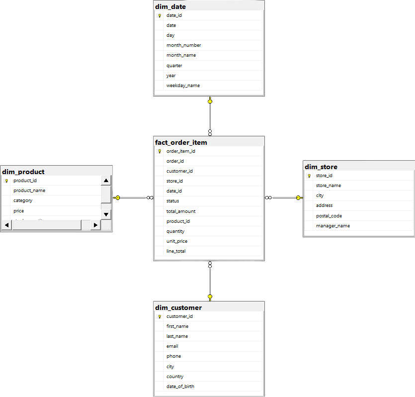
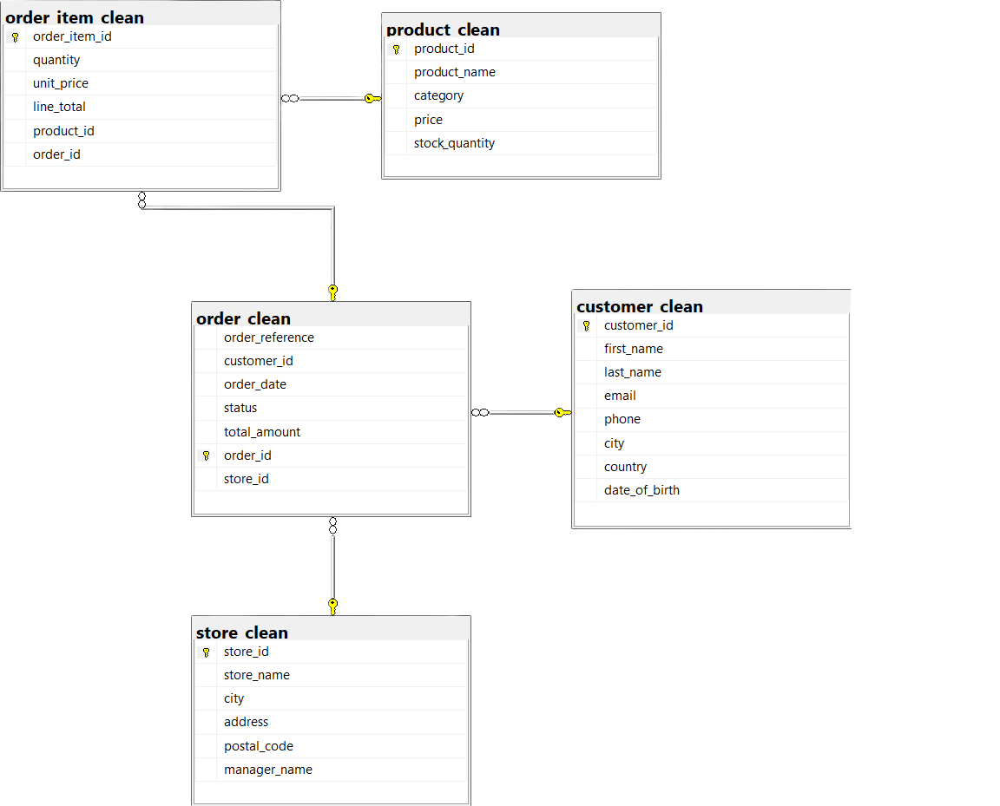

# Retail Sales Analysis


## Project Overview
This project covers the full data analysis and Business Intelligence pipeline using synthetically generated retail sales data.
The data is extracted, cleaned and loaded into a normalised relational database in SQL Server. It is then transformed into a 
star schema optimised for reporting in Power BI. The entire pipeline is automated using a Python ETL script and the 
findings of the analysis are documented in a final report.

## Star Schema
The final schema is a star schema with `fact_order_item` as the fact table. It has four dimensions: `dim_store`, `dim_product`, `dim_date` and `dim_customer`, each linked with their respective foreign keys. The `order_id` is a reference that links back to the relational layer.

<p align="center">
  
  <br>
  <em>Star schema generated from SSMS Database Diagrams</em>
</p>

## Relational Schema
Even though the star schema was the final product, I first normalised the data into a fully relational database with proper primary and foreign key constraints. This reflects how real-world systems are often structured before being transformed into an analytical layer.

<p align="center">
  
  <br>
  <em>Relational schema generated from SSMS Database Diagrams</em>
</p>


## Pipeline
The entire ETL process is automated using a Python script that extracts raw CSV files, loads them into SQL Server as staging tables, then executes all SQL cleaning and transformation scripts in order.

```python
files = extract_data('./data/raw')
load_raw_data(files, server)
con = connect_to_database(server)
execute_scripts(con, './sql')
```

## How to Run
1. Clone the repository
```
git clone https://github.com/MarkSmolders/Retail-Sales-Analysis.git
```
2. Add your raw CSV files to `./data/raw`
3. Install dependencies
```
pip install -r requirements.txt
```
4. Run the pipeline
```
python etl.py
```
5. Enter your SQL Server instance name when prompted (e.g. `localhost` or `LAPTOP-NAME\instance`)
6. Open Power BI Desktop and connect to your SQL Server instance, database `RetailSales`


## Dashboard
*PowerBI screenshot will be added when finished*

## Folder Structure
```
Retail-Sales-Analysis/
├── data/
│   └── raw/          # Raw CSV files
├── images/           # Schema diagrams and visuals
├── powerbi/          # Power BI dashboard file
├── sql/              # SQL cleaning and transformation scripts
├── etl.py            # Python ETL pipeline
├── requirements.txt  # Python dependencies
└── README.md
```

## Known Limitations
- The pipeline assumes CSV files match the expected column structure